WebGPU Render
==============================================

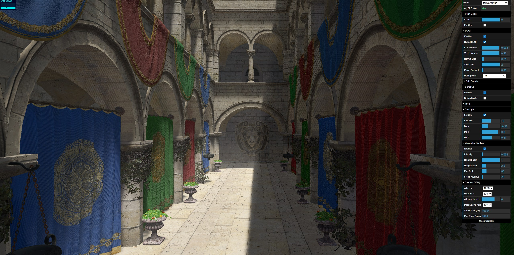

## [Live Demo](https://tsingloo.github.io/WebGPU-Playground/)

* **University of Pennsylvania, CIS 565: GPU Programming and Architecture, Project 4**

* Tested on: 

  | Component\Platform | PC                                              | Mobile                                                       |
  | ------------------ | ----------------------------------------------- | ------------------------------------------------------------ |
  | OS                 | Google Chrome(141.0.7390.108) @ Windows 11 24H2 | Google Chrome(141.0.7390.111) @ Android 14                   |
  | CPU/SoC            | Intel 13600KF @ 3.5Ghz                          | [MediaTek Dimensity 8100](https://www.mediatek.com/products/smartphones/mediatek-dimensity-8100) |
  | GPU                | 4070 SUPER 12GB                                 | Arm Mali-G610 MC6                                            |
  | RAM                | 32GB RAM                                        | 12GB RAM                                                     |
  | Model              |                                                 | Redmi K50                                                    |

### Demo Video/GIF

https://github.com/user-attachments/assets/7da29776-83ef-4660-9702-f51ed1dad99b

# Features

## Render Graph Architecture

A custom Render Graph (Frame Graph) is implemented for automatic resource management, pass scheduling, and intelligent memory aliasing.

- **Dependency Tracking**: Tracks resource reads and writes across rendering/compute passes to build a Directed Acyclic Graph (DAG) and calculate topological sorting.
- **Resource Aliasing**: Allocates internal physical textures and buffers efficiently based on resource lifespans using interval scheduling, reducing peak memory load.
- **Intelligent Ops**: Automatically infers WebGPU `clear` and `discard` states based on the first/last usage index of each resource, saving memory bandwidth.
- **Caching**: Hashes pass topology to avoid recompilation costs for static frames.

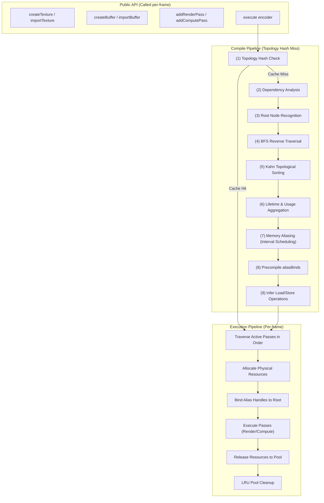

### Single Frame Execution Sequence

This sequence highlights what happens dynamically per-frame, showing where the caching mechanism bridges logical pass declarations with physical GPU allocations and callback execution.

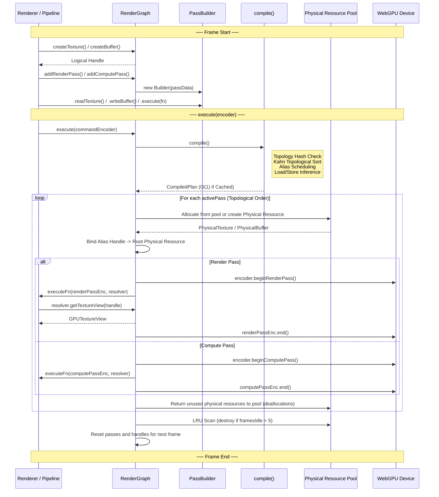

### Resource Lifetime & Memory Aliasing

To drastically reduce VRAM usage, physical resources from the pool are aliased dynamically. Logical resource handles that do not overlap in lifetime will automatically share the exact same physical WebGPU resource in sequential order, preventing unnecessary allocations pipeline-wide.

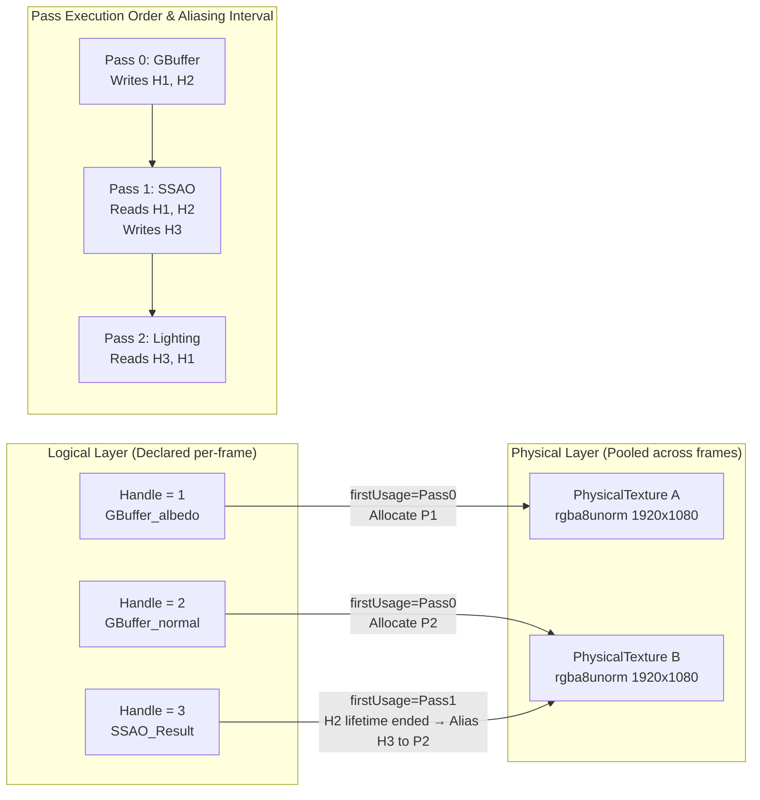

---

## Rendering Pipelines

### Forward+

The Forward+ pipeline performs clustered light culling before the main shading pass. It consists of three stages: Z-prepass, light culling, and the shading pass. This approach retains the simplicity of a single forward pass while supporting efficient per-fragment lighting from many sources. Compared to classic deferred, it naturally handles transparency and flexible material models.

### Clustered Deferred (Compute Pass)

The deferred path writes albedo, position, and normal into G-buffers, then performs light culling and shading in a subsequent pass. In this implementation, the traditional fragment-based lighting stage is replaced by a compute shader that dispatches one thread per screen pixel, combining the vertex and fragment stages into a single programmable step. The full pipeline is: Z-prepass, G-buffer pass, light culling, compute shading pass, and final blit.

---

## Z-Prepass

An early Z-prepass fills the depth buffer before any shading work begins. A simple vertex shader transforms geometry and a minimal fragment shader discards transparent fragments by alpha testing. The main shading pass then uses `depthCompare: equal`, so only the front-most fragments get shaded. This is particularly useful in scenes like Sponza where overlapping geometry would otherwise result in significant overdraw.

---

## Clustered Light Culling

The view frustum is divided into a 3D grid of clusters. A compute shader determines which lights overlap each cluster, and during shading each fragment retrieves the relevant light list by its cluster index.

### Single Global Buffer

Instead of per-cluster light lists, a single global buffer stores all light indices. Each cluster records an offset and count into this buffer. This is more memory-efficient, but the approach is bounded by WebGPU's maximum storage buffer binding size (134,217,728 bytes). At high grid resolutions with thousands of lights, the buffer can overflow, causing visible tiled artifacts or missing lights.

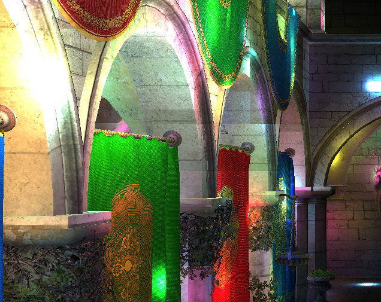

### Logarithmic Z-Slicing

The Z-axis is sliced logarithmically rather than linearly in view space, which distributes clusters more evenly across the depth range and improves culling precision near the camera. Based on [A Primer On Efficient Rendering Algorithms & Clustered Shading](https://www.aortiz.me/2018/12/21/CG.html).

---

## PBR Shading (Cook-Torrance)

All lighting uses a physically-based Cook-Torrance BRDF with GGX normal distribution, Smith geometry, and Fresnel-Schlick approximation. The material pipeline reads glTF PBR parameters (base color, metallic, roughness) from textures and uniforms, and supports tangent-space normal mapping with Gram-Schmidt re-orthogonalization. A Reinhard tone mapper and gamma correction are applied as the final step.

---

## Image-Based Lighting (IBL)

Full split-sum IBL is computed entirely on the GPU at startup:

- **Environment Cubemap** -- A procedural sky cubemap (256x256 per face) is generated by a compute shader at initialization. Users can also upload custom `.hdr` or `.exr` environment maps, which are converted from equirectangular to cubemap via another compute pass.
- **Diffuse Irradiance** -- The environment cubemap is convolved into a 32x32 irradiance cubemap for diffuse ambient.
- **Prefiltered Specular** -- A roughness-stratified prefiltered cubemap (128x128, 5 mip levels, 1024 importance samples per mip) is generated for specular IBL.
- **BRDF LUT** -- A 256x256 LUT is precomputed for the split-sum integral's scale and bias terms.

The skybox is rendered as a fullscreen pass with reverse depth (`less-equal`), so it appears behind all geometry.

---

## Probe-Based Global Illumination (DDGI-style)

A probe-based diffuse GI system inspired by DDGI. The overall framework -- probe grid, irradiance/visibility octahedral atlases, hysteresis blending, Chebyshev visibility weighting -- follows the standard DDGI pipeline. Since WebGPU does not currently expose hardware ray tracing, the probe trace stage utilizes a **software ray tracer**. Rays are traced directly against a **Bounding Volume Hierarchy (BVH)** built from the scene's triangle geometry, rather than using RT cores.

The per-frame compute pipeline consists of:

1. **Probe Trace (Software Ray Tracing)** -- Each probe fires rays through the scene's BVH. On intersection with geometry, the hit surface's normal is evaluated for direct sun lighting (with VSM shadow lookup). Missed rays sample the environment cubemap.
2. **Irradiance Update** -- Ray radiance results are blended into the irradiance atlas using exponential hysteresis, with octahedral encoding per probe.
3. **Visibility Update** -- Mean distance and squared distance are accumulated for Chebyshev-based visibility testing.
4. **Ping-Pong Atlases** -- Double-buffered atlas textures prevent read-write hazards across frames.

During shading, each fragment performs trilinear interpolation across the 8 surrounding probes, weighted by Chebyshev visibility to suppress light leaking.

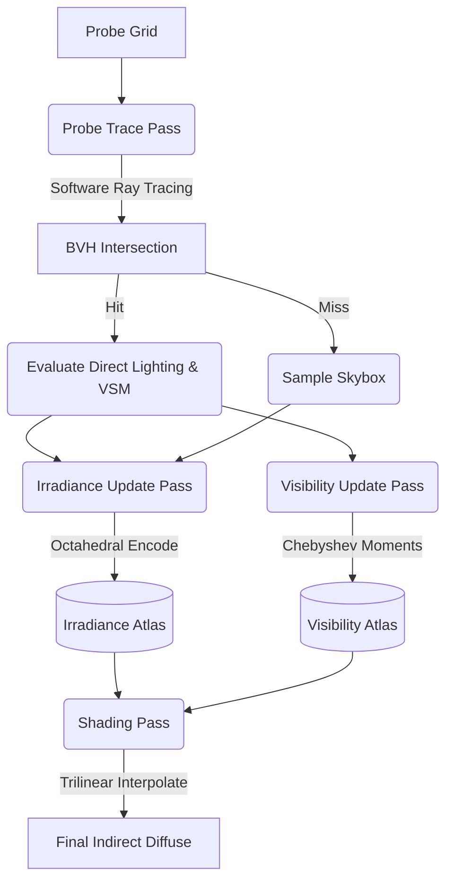

## Virtual Shadow Maps (VSM)

Shadows from the directional (sun) light use a clipmap-based Virtual Shadow Map system. The pipeline runs entirely on the GPU:

1. **Clear Pass** -- Resets page request flags and allocation state.
2. **Mark Pass** -- A compute shader reprojects each screen pixel into light space to determine which virtual shadow pages are needed.
3. **Allocate Pass** -- Requested pages are assigned physical slots from an atlas pool.
4. **Render Pass** -- Scene geometry is rasterized into the physical atlas with per-level orthographic projections. Each clipmap level covers a progressively larger region (16 to 512 world units), centered on the camera with sub-texel snapping to eliminate shadow swimming.

The shadow lookup in the fragment shader walks the page table to find the physical atlas tile for the current fragment's light-space position. The default configuration is a 4096x4096 physical atlas with 128-texel pages and 6 clipmap levels.

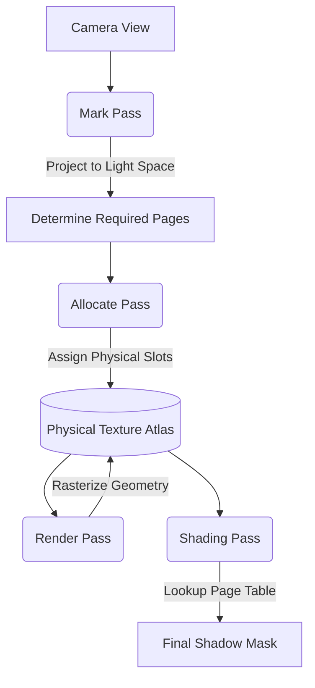

---

## Screen-Space Ambient Occlusion (SSAO)

A screen-space AO pass samples the G-buffer depth and normals to estimate local occlusion. The raw AO result is blurred with a box filter to reduce noise, then multiplied into the ambient term of the final shading. Radius, bias, and power are adjustable at runtime.

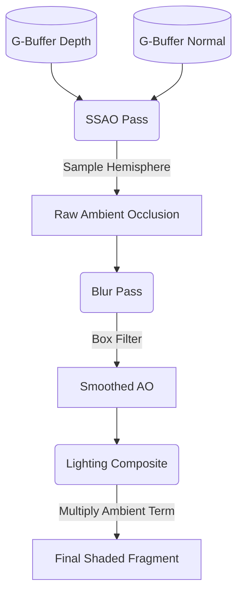

---

## Spectral Path Tracing & Dispersion

A spectral path tracing mode is implemented using the hero-wavelength approach (inspired by pbrt v4).
- **CIE Color Matching**: Uses Wyman Gaussian for accurate spectrum-to-RGB conversion, along with Smits RGB-to-Spectrum logic.
- **Dispersion**: Supports Cauchy's equation for modeling wavelength-dependent index of refraction (IOR), producing realistic chromatic aberration and prism effects.
- **Throughput & Light Transport**: Traces 4 hero wavelengths per pixel simultaneously to efficiently estimate full spectral transport.
- **Toggleable**: Users can seamlessly turn this on or off via the GUI.

### Spectral Rendering Comparison

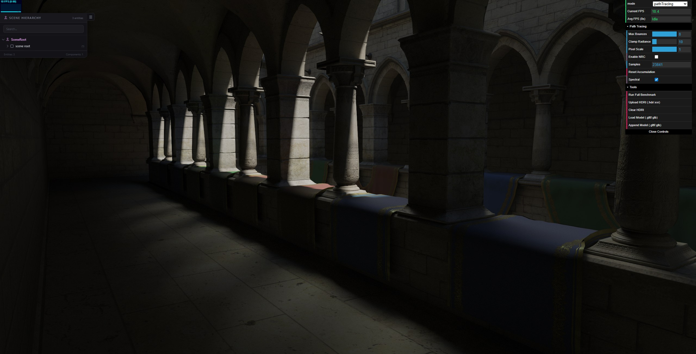

---

# Performance Analysis

## Benchmark Setup

All test results are obtained with the cluster dimensions configured as **x = 16, y = 16, z = 16**, and a **maximum of 1024 lights per cluster**, rendering at a fixed resolution of **1080p**.

A benchmark script automatically varies the number of active lights in the scene and measures performance by counting how many frames are rendered within a given time period.

## Mobile & PC 

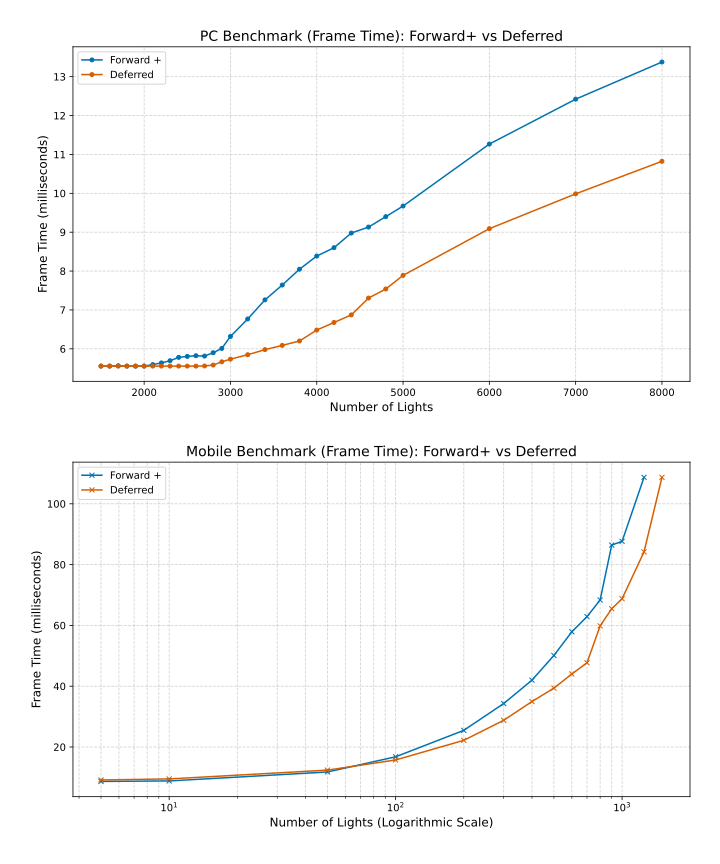

The PC benchmark results performed as expected, initially demonstrating the clear advantage of powerful desktop hardware and high memory bandwidth. In the early stage, both Forward+ and Deferred rendering were so efficient they were simply limited by the 180 FPS cap. However, the distinction emerged as Forward+ began to degrade first at 2100 lights, indicating it hit a compute bottleneck as its fragment shader complexity scaled with the light count. Deferred rendering sustained peak performance until 2700 lights. 

Contrary to the common assumption that **deferred rendering** is problematic for mobile platforms due to bandwidth constraints, the benchmark results indicate **a performance advantage over Forward+ rendering in scenarios with high light counts**. While the deferred approach exhibited a minor initial overhead with fewer than 100 lights, its performance scaled more effectively as the scene complexity increased.

## Deferred Rendering by Single Compute Pass (Extra Credit)

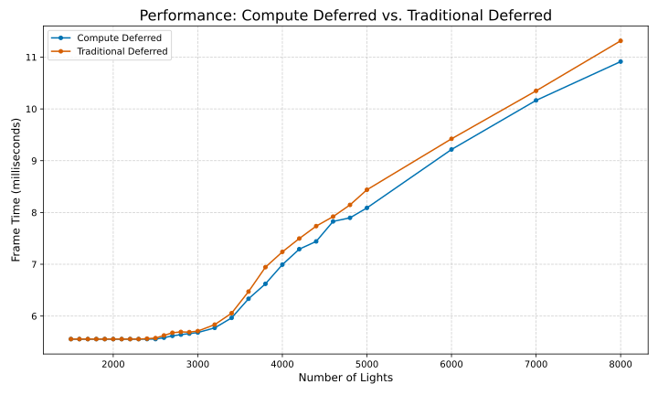

Both deferred rendering methods exhibit identical performance at lower light counts and when the light count exceeds 2,400, a consistent performance gap appears. The **Compute Deferred approach maintains a lower frame time compared to the Traditional Deferred** method, and this gap widens as the number of lights scales up. 

The performance advantage comes from the compute shader's ability to skip the GPU's fixed-function rasterization stage and run directly on compute units. Instead of running per-pixel like fragment shaders, compute shaders work in small groups allowing threads to share and reuse lighting data efficiently using fast shared memory. This reduces unnecessary global memory access and lowers overall bandwidth usage.

# Debug Images 

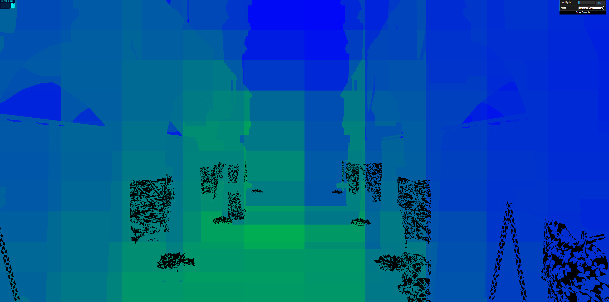

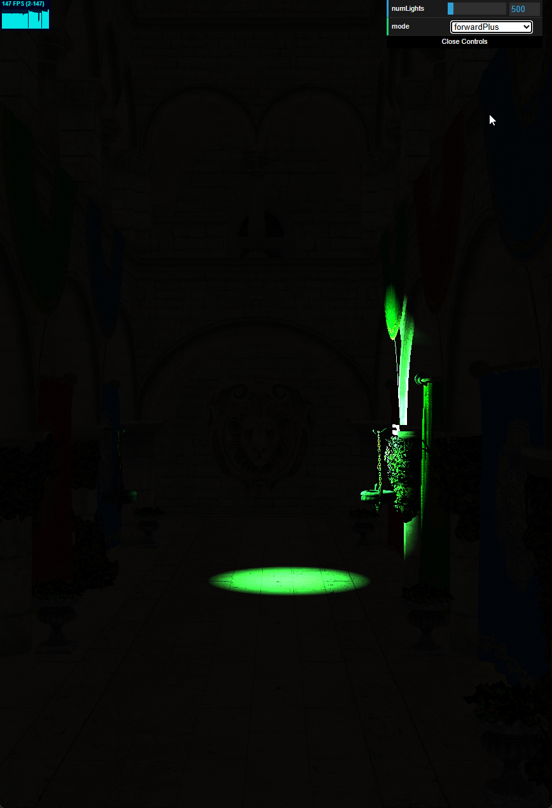

# Credits

- [A Primer On Efficient Rendering Algorithms & Clustered Shading.](https://www.aortiz.me/2018/12/21/CG.html)
- [Vite](https://vitejs.dev/)
- [loaders.gl](https://loaders.gl/)
- [dat.GUI](https://github.com/dataarts/dat.gui)
- [stats.js](https://github.com/mrdoob/stats.js)
- [wgpu-matrix](https://github.com/greggman/wgpu-matrix)
