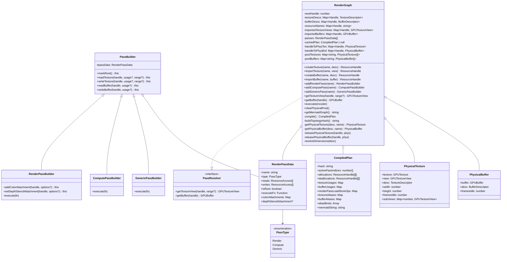
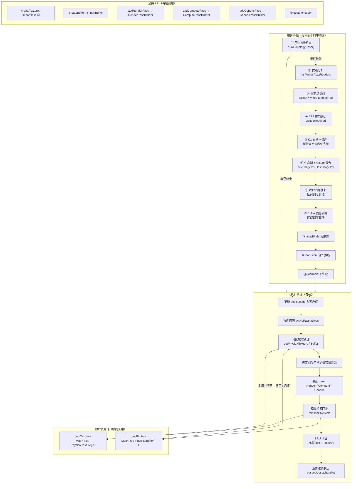
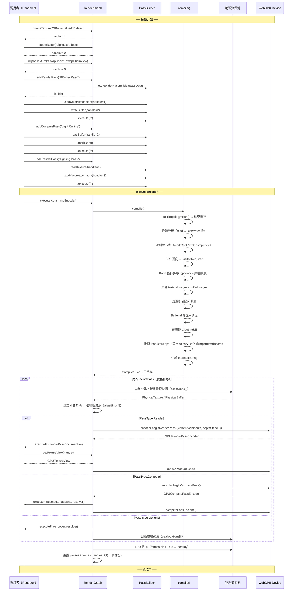
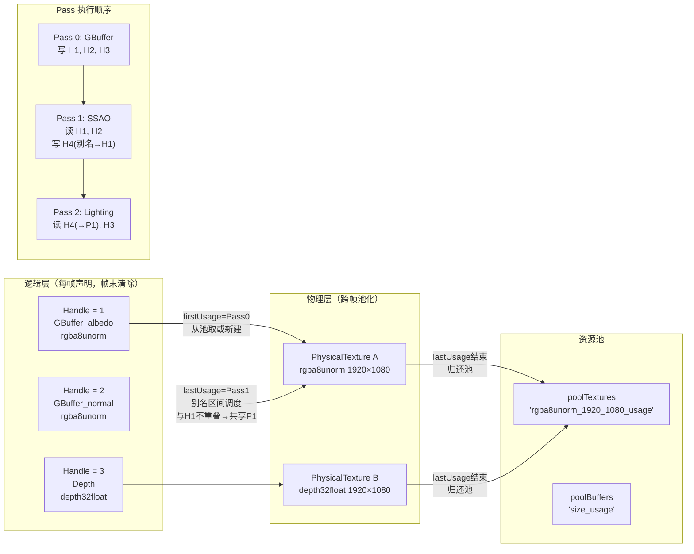
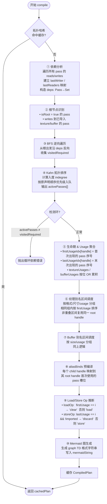
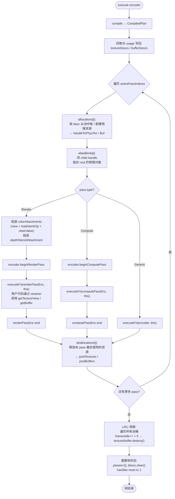
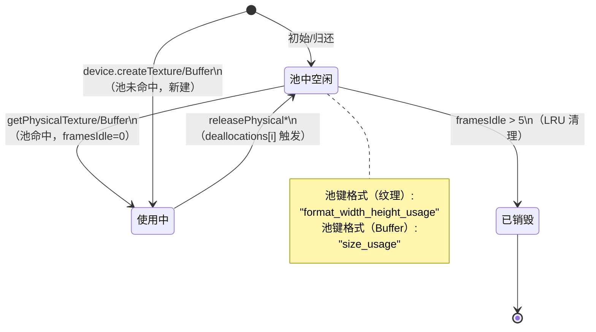

# RenderGraph — 架构与时序图

> 源文件: `src/engine/RenderGraph.ts`（879 行）

---

## 1. 整体架构（类图）



---

## 2. 模块层次结构



---

## 3. 帧执行时序图



---

## 4. 资源生命期与内存别名



**别名规则（区间调度）：**

```
资源 H1:  [Pass0 ─────────── Pass1]
资源 H2:  [Pass0 ─── Pass0]          ← 生命期早于 H1 结束前结束，无法复用
资源 H4:              [Pass1 ── Pass2] ← H1 结束后开始 → 分配别名到 H1 的物理资源
```

---

## 5. 编译管线数据流（compile()）



---

## 6. execute() 单帧执行流程



---

## 7. 物理资源池（对象池模式）



---

## 关键设计要点

| 机制 | 说明 |
|------|------|
| **拓扑缓存** | 每帧计算 hash，拓扑不变时跳过重编译，O(1) 路径直接执行 |
| **逆向可达性裁剪** | 未被根节点依赖的 pass 自动剔除，无需手动管理 |
| **Kahn 拓扑排序** | 优先级队列维持原声明顺序，保证确定性 |
| **内存别名（Aliasing）** | 生命期不重叠的同类资源复用同一物理对象，减少 GPU 内存分配 |
| **Load/Store 推断** | 首次使用自动 clear，末次非导入使用自动 discard，减少带宽 |
| **对象池 + LRU** | 物理资源跨帧复用，超过 5 帧空闲则销毁，平衡内存与分配开销 |
| **句柄重置** | 每帧末 nextHandle 重置为 1，保证跨帧拓扑哈希可比较 |
| **子资源视图缓存** | `subViews: Map<encodedRange, GPUTextureView>` 按需创建并缓存 mip/layer 视图 |
