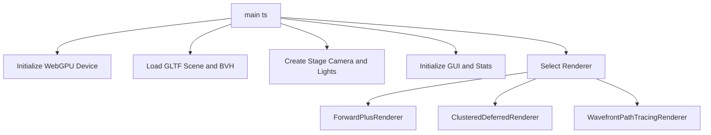
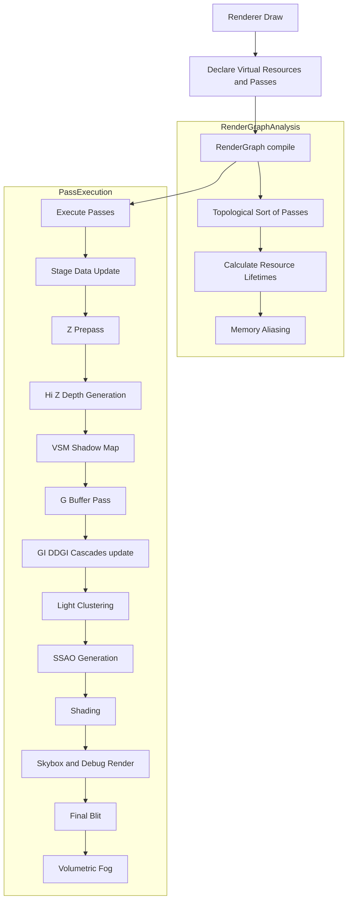
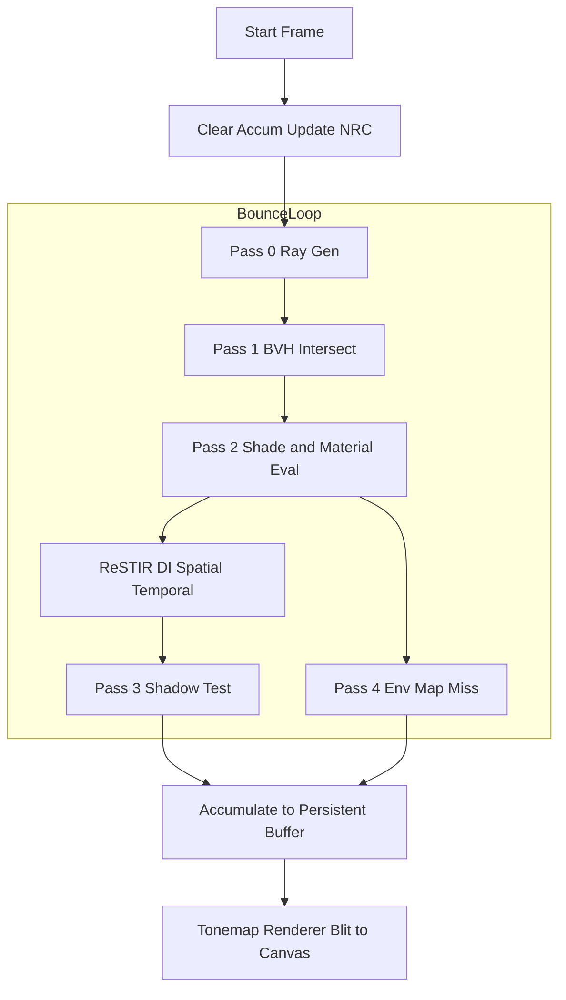
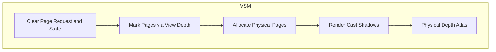
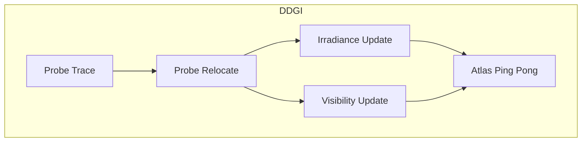

# Structure & Flowchart

This document details the code architecture, module interactions, and the rendering pipelines' structure for the WebGPU renderer project.

## Application Entry & Setup (`main.ts`)

The application starts in `main.ts`, which sets up the rendering environment, parses UI selections, and glues the systems together.

## RenderGraph Execution Flow

All base renderers use a bespoke `RenderGraph` (`src/engine/RenderGraph.ts`) to orchestrate passes. This graph handles topological sorting, dependency tracking, and automatic resource memory aliasing.

## Wavefront Path Tracing Data Flow

The `WavefrontPathTracingRenderer` executes a distinct wavefront bounce loop, utilizing state-of-the-art compute shaders and ReSTIR for Direct Illumination (ReSTIR DI updates only occur on Bounce 0).

## Virtual Shadow Maps (VSM)

The Virtual Shadow Map module (`src/stage/vsm.ts`) implements a clipmap-based virtualized shadow mapping algorithm. It uses GPU-driven allocation to render high-resolution shadows over vast distances without exhausting VRAM.

## Dynamic Diffuse Global Illumination (DDGI)

The DDGI module (`src/stage/ddgi.ts`) utilizes a grid of light probes spread across the scene. These probes trace rays into the BVH to gather lighting, which is temporally blended into irradiance and visibility atlases.

